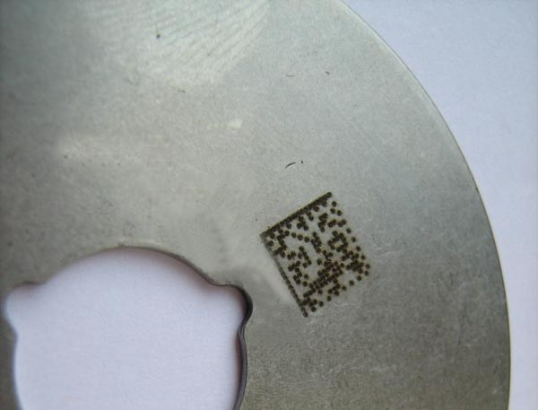
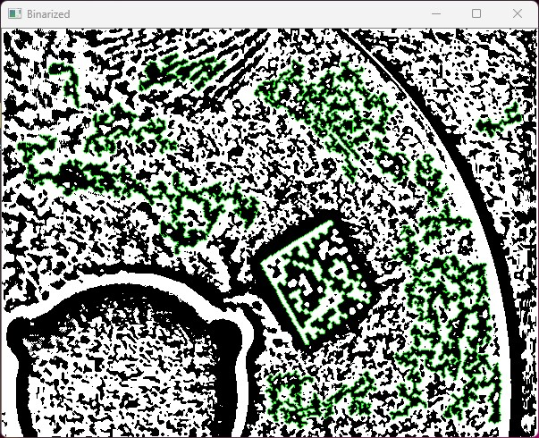
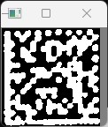
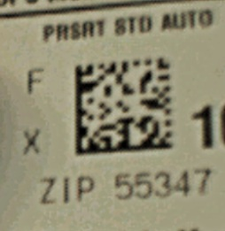
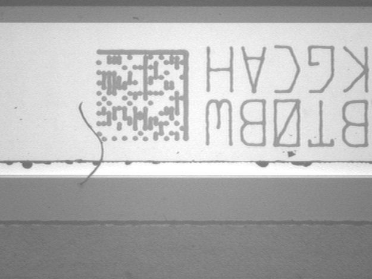
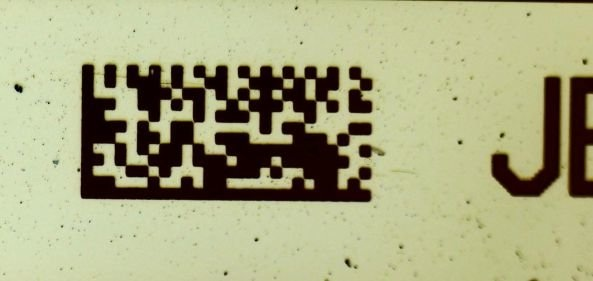
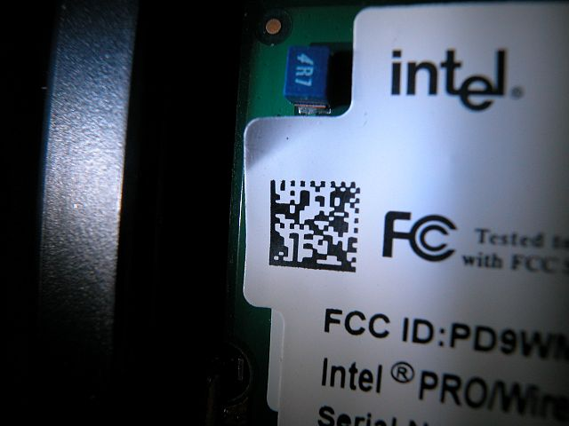
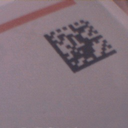
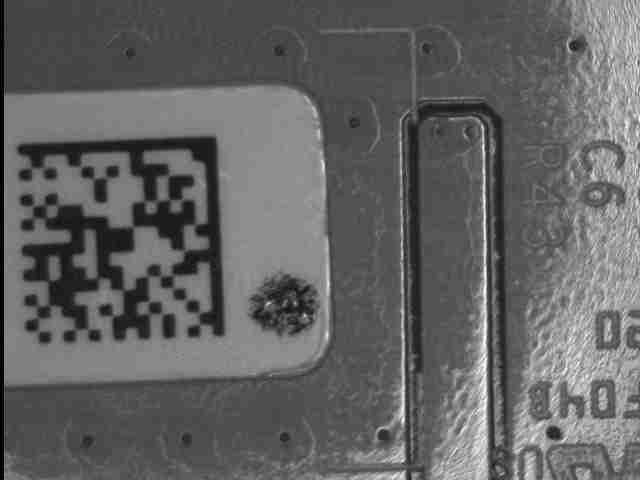
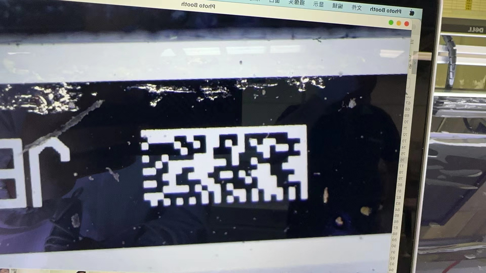

# LemonDecoder

A simple, fast Datamatrix decoder based on OpenCV

## Usage

- **LemonDecoder** relies on OpenCV 2.0.0+, the include, library directories and linkers should be configured beforehand.

- **Decode from a image file** 

    ```cpp
    #include <iostream>

    #include "lemon_api.h"

    using std::vector;

    int main() {
      vector<vector<uchar>> message;

      // namespace hyf_lemon is used
      // return true if decoding is success
      // if success, output each datamatrix code in the 
      // image file via vector<vector<uchar>> message
      if (hyf_lemon::Decode_file("1.jpg", &message)) {
          // TODO
      }
    }
    ```

- **Decode from captured in-memory image**

    ```cpp
    // capture images by a camera
    // ...

    // call Decode_rt, set the image size, and pointer 
    // to the captured image data
    bool hyf_lemon::Decode_rt(const int width, const int height, const uchar* image_data, std::vector<std::vector<uchar>>* output);
    ```

## LemonDecoder work flow

There are four main steps that LemonDecoder takes to decode a image.

- **Step 1: Image Process**. Binarize the source image, and find all contours, filter out those which are impossible to be a datamatrix.

    [](samples/1.jpg)
     source image

    The **Process** method of ImageProcessor will output the binarized image and all possible contours:

    ```cpp
    ImageProcessor processor;
    processor.set_image(image);

    Mat binarized;
    vector<PointSeq> contours;
    processor.Process(&binarized, &contours);    
    ```
    [](samples/image_process.jpg)
     binarized image and possible contours

- **Step 2: Datamatrix locate**. Check all possible contours again to see if they match certain features of the DataMatrix rule, then output datamatrix images.

    ```cpp
    DatamatrixLocator locator;
    locator.set_image(binarized);
    locator.set_contours(contours);
    vector<Mat> datamatrixs;

    // return the number of datamatrixs found, and 
    // output the images
    int count = locator.LocateDatamatrix(image(), processor, &datamatrixs);
    ```
    [](samples/datamatrix_locate.jpg)
     datamatrix image

- **Step 3: Datamatrix Read**. Read every binary codes in the datamatrix image.

    ```cpp
    DatamatrixReader reader;
    for (Mat datamatrix : datamatrixs) {
      reader.set_image(datamatrix);
      vector<int> codes;
      reader_.Read(processor_, &codes);
    }    
    ```
    When print out the binary codes, it would be like this:

    ```cpp
        1 0 1 0 1 0 1 0 1 0 1 0 1 0 1 0 1 0
        1 0 0 1 0 0 1 0 0 0 0 0 0 1 0 1 0 1
        1 1 0 0 0 1 0 0 1 1 1 0 1 1 1 1 1 0
        1 0 0 1 0 1 0 1 1 0 1 1 1 0 1 1 0 1
        1 1 0 1 1 0 0 0 1 0 1 0 1 0 1 0 0 0
        1 0 0 0 1 1 0 0 1 1 0 0 0 1 0 0 0 1
        1 1 1 0 0 0 0 0 0 0 1 0 1 1 1 0 0 0
        1 0 0 0 0 1 1 1 0 1 1 1 1 1 1 0 0 1
        1 1 1 1 0 0 1 1 1 0 0 1 1 0 1 1 1 0
        1 0 1 0 0 1 0 0 0 0 1 0 1 1 1 0 1 1
        1 0 0 0 1 0 0 0 0 0 0 0 1 1 1 0 1 0
        1 1 0 1 0 0 1 1 1 1 0 0 0 1 1 0 0 1
        1 0 1 0 0 0 0 1 0 1 0 0 0 1 1 1 0 0
        1 1 1 0 0 0 1 0 1 0 0 1 0 1 1 0 0 1
        1 0 1 1 1 0 1 0 1 1 1 0 1 0 1 0 1 0
        1 1 0 0 1 1 0 0 1 0 1 1 0 0 1 1 1 1
        1 0 1 0 1 0 0 0 0 0 0 0 0 0 0 1 0 0
        1 1 1 1 1 0 1 1 1 1 1 1 1 1 1 1 1 1    
    ```
- **Step 4: Datamatrix Decode**. Decode the binary codes into text according to DataMatrix decode rules.

    ```cpp
    DatamatrixDecoder decoder(size_vert, size_hori, codes);
    vector<int> message;
    decoder.decode(&message);    
    ```
- **Overall output**:

    ```cpp
    >>>  Take 1
    Step 1 - Image Process: 31 possible contours found.
    Step 2 - Datamatrix Locator: 1 possible Datamatrix found.
    Step 3 - Datamatrix Reader:
    1 0 1 0 1 0 1 0 1 0 1 0 1 0 1 0 1 0
    1 0 0 1 0 0 1 0 0 0 0 0 0 1 0 1 0 1
    1 1 0 0 0 1 0 0 1 1 1 0 1 1 1 1 1 0
    1 0 0 1 0 1 0 1 1 0 1 1 1 0 1 1 0 1
    1 1 0 1 1 0 0 0 1 0 1 0 1 0 1 0 0 0
    1 0 0 0 1 1 0 0 1 1 0 0 0 1 0 0 0 1
    1 1 1 0 0 0 0 0 0 0 1 0 1 1 1 0 0 0
    1 0 0 0 0 1 1 1 0 1 1 1 1 1 1 0 0 1
    1 1 1 1 0 0 1 1 1 0 0 1 1 0 1 1 1 0
    1 0 1 0 0 1 0 0 0 0 1 0 1 1 1 0 1 1
    1 0 0 0 1 0 0 0 0 0 0 0 1 1 1 0 1 0
    1 1 0 1 0 0 1 1 1 1 0 0 0 1 1 0 0 1
    1 0 1 0 0 0 0 1 0 1 0 0 0 1 1 1 0 0
    1 1 1 0 0 0 1 0 1 0 0 1 0 1 1 0 0 1
    1 0 1 1 1 0 1 0 1 1 1 0 1 0 1 0 1 0
    1 1 0 0 1 1 0 0 1 0 1 1 0 0 1 1 1 1
    1 0 1 0 1 0 0 0 0 0 0 0 0 0 0 1 0 0
    1 1 1 1 1 0 1 1 1 1 1 1 1 1 1 1 1 1
    Step 4 - Decode Result: 06 S SKF D 05812
    time spend: 28.8837ms        
    ```

## Settings

The binarization method and parameters are crucial for the likelihood of successfully decoding the images. The default settings of LemonDecoder make it possible to adapt to various situations of the images (see the directory: /samples), yet some options are offered.

- **Reversed Image**. Normally, the datamatrix in an image is darker and the background is brighter, otherwise **reversed** should be set to true. LemonDecoder sets it automatically, but in order to save some CPU time, it's better to set it in advance if possible and necessary. 

    ```cpp
    // default: false
    SetReversed(true);
    ```
- **Binarization Method**.

    ```cpp
    SetBinMethod(BIN_NORMAL);
    // or
    SetBinMethod(BIN_ADAPTIVE); // defaut
    ```
- **Binarization Threshold**. Only work for BIN_NORMAL method.

    ```cpp
    SetBinNormalTh(85); // 0~255, defaut 127
    ```
- **Adaptive Block Size**. Only work for BIN_ADAPTIVE method.

    ```cpp
    SetBinAdaptiveBlock(35); // odd number, defaut 25
    ```


## Examples

[](samples/n1.jpg)

[](samples/n3.jpg)

[](samples/2.jpg)

[](samples/3.jpg)

[](samples/n6.jpg)

[](samples/n9.jpg)

[](samples/8.jpg)


## Contact

cheng-ran@outlook.com